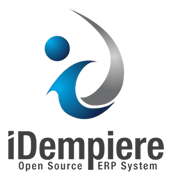
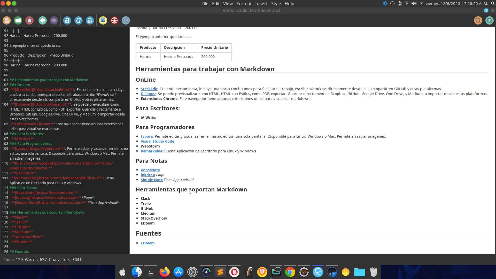
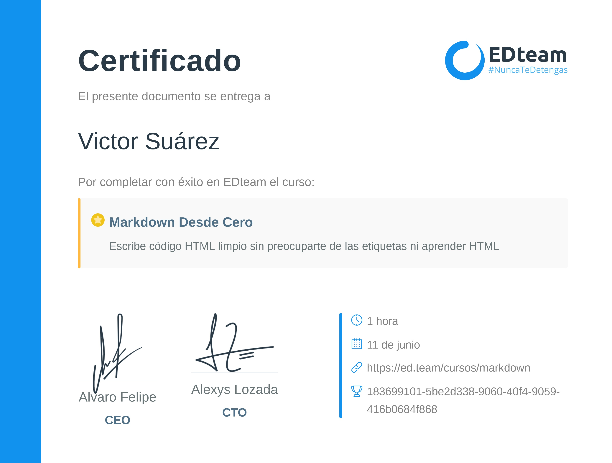

# Markdown

* **Autor: Ing. Victor Suarez**  -  victor.suarez.is@gmail.com
* **Fecha:** Junio 2020 

Herrramienta de Lenguaje de marcado, que simplifica la escritura de **HTML**.
## Usos
- Es usado para generar Documentacion de Proyectos de Programacion, a nivel tecnico y funcional.
- Escribir Tesis
-  Escritores.

Es una herramienta muy buena para escribir, y concentrarse principalmente en esto, y no tanto en formatear el documento.

### Titulos y subtitulos
Para escribir los Titulos, simplemente se escribe `#`, para un titulo principal, para titulos secundarios `##`, y asi, a medida que se agregan mas `#`, los titulos se hacen mas pequeños.

### Negritas y Cursivas
- Para escribir *cursivas* es un `*` de cada lado, ejemplo: `*Texto en  cursiva*`
- Para escribir parabras en **negritas**, se encierran las palabras entre dos `**` de cada lado, ejemplo: `**Texto en negrita**`
- Para ***negritas y cursivas***, se usan 3 `***`, ejemplo: `***Texto en negrita y cursiva***`.

### Imagenes y Links
- Para agregar una imagen a un documento Markdown se escribe: ``, ejemplo: ``: 

- Para agregar un Link: `[iDempiere](https://www.idempiere.org/)`, quedaria así: [iDempiere](https://www.idempiere.org/).
- En caso de que un Link o imagen se repita varias veces en el documento, hay una manera de agregarlos mas facil: Se coloca entre `[]` la palabra que se va a repetir con el link, y al final del documento la palabra entre `[]: link`. Ejemplo:
`[iDempiere] Es un Software ERP de Codigo Abierto.`
`[iDempiere]: https://www.idempiere.org/`
Quedando asi:
[iDempiere] Es un Software ERP de Codigo Abierto.
[iDempiere]: https://www.idempiere.org/.
	- En el caso de las imagenes es la misma logica, pero de la siguiente manera: `![Nombre imagen][referencia a imagen al final]`.

### Codigo fuente
Hay dos maneras de agregar codigo fuente:
- *En Linea*, es dentro de una linea donde estemos escribiendo, ejemplo:  Para imprimir en consola Java se hace con ` `System.out.println("Hola Mundo");` `, esto quedaria asi: Para imprimir en consola Java se hace con  `System.out.println("Hola Mundo");` .
- *En Bloques*, se agrega un bloque de codigo. Usando ` ``` ` una linea antes del codigo y una linea despues de terminar el mismo. Ejemplo:
``` md

​``` Java
	/**
	 * 	Get MInvoice from Cache
	 *	@param ctx context
	 *	@param whereClause sql where clause
	 *	@param trxName trx
	 *	@return MBSCAAcctLedger
	 */
	public static List<MInvoice> get (Properties ctx, String whereClause, String trxName)
	{
		List<MInvoice> list = new Query(ctx, Table_Name, whereClause, trxName)
								.setClient_ID()
								.list();
		return list;
	}	//	get
	
```

Quedando asi:

``` java
	/**
	 * 	Get MInvoice from Cache
	 *	@param ctx context
	 *	@param whereClause sql where clause
	 *	@param trxName trx
	 *	@return MBSCAAcctLedger
	 */
	public static List<MInvoice> get (Properties ctx, String whereClause, String trxName)
	{
		List<MInvoice> list = new Query(ctx, Table_Name, whereClause, trxName)
								.setClient_ID()
								.list();
		return list;
	}	//	get
```

### Citas
Para marcar citas se usa `>` al inicio de la misma. Ejemplo:

```md
> En algun lugar de la mancha, cuyo nombre  no quiero ni acordarme

```
Quedando asi:
> En algun lugar de la mancha, cuyo nombre  no quiero ni acordarme


### Tablas
La sintaxis para agregar una tabla es, algo como esto:
Producto | Descripcion | Precio Unitario
```
---|---|---
Harina | Harina Precocida | 200.000
```

El ejemplo anterior quedaria asi:

Producto | Descripcion | Precio Unitario 
---|---|---
Harina | Harina Precocida | 200.000


## Herramientas para trabajar con Markdown
### OnLine
- **[StackEdit](https://stackedit.io/)**:  Exelente herramienta, incluye una barra con botones para facilitar el trabajo, escribir *WordPress* directamente desde alli, compartir en GitHub y otras plataformas.
- **[Dillinger](https://dillinger.io/)**:  Se puede previsualizar como HTML, HTML con Estilos, como PDF, exportar. Guardar directamente a Dropbox, GitHub, Google Drive, One Drive, y Medium, o importar desde estas plataformas.
- **Extensiones Chrome**:  Este navegador tiene algunas extensiones utiles para visualizar markdown.
### Para Escritores:
- **iA Writer**
### Para Programadores
- **[typora](https://typora.io/)**: Permite editar y visualizar en el mismo editor, una sola pantalla. Disponible para Linux, Windows o Mac. Permite arrastrar imagenes.
- **[Visual Studio Code](https://code.visualstudio.com/Docs/languages/markdown)**
- **WebStorm**
- **[Remarkable](https://remarkableapp.github.io/)**: Buena Aplicacion de Escritorio para Linux y Windows
	
### Para  Notas
- **[BoostNote](https://boostnote.io/)**
- **[inkdrop](https://www.inkdrop.app/)** *Pago*
- **[Simple Note](https://simplenote.com/)** *Tiene App Android*

### Herramientas que soportan Markdown
- **Slack**
- **Trello**
- **GitHub**
- **Medium**
- **StackOverflow**
- **EDteam**

## Fuentes
- **[EDteam]()**

## Certificado EDteam Victor Suarez:

